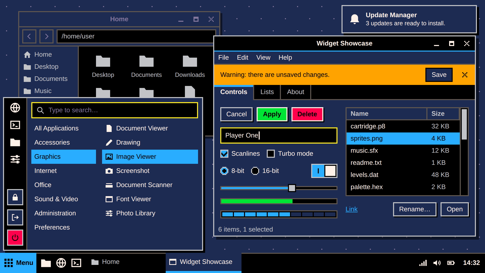
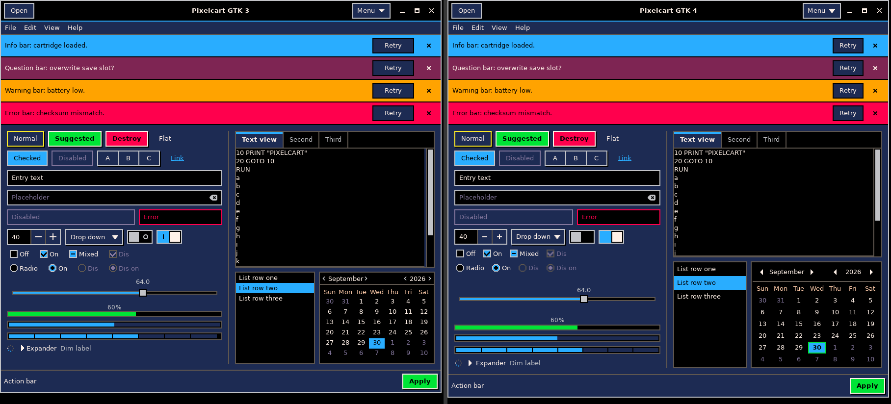
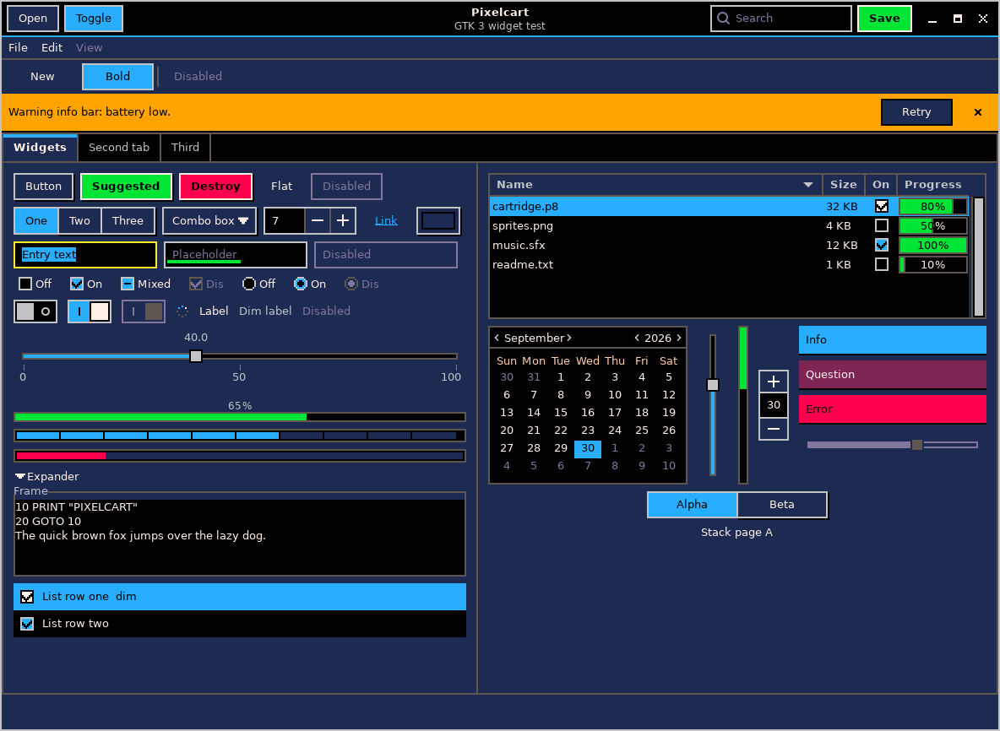
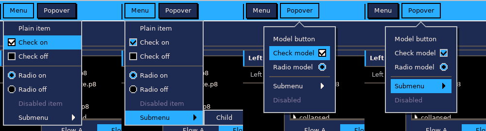
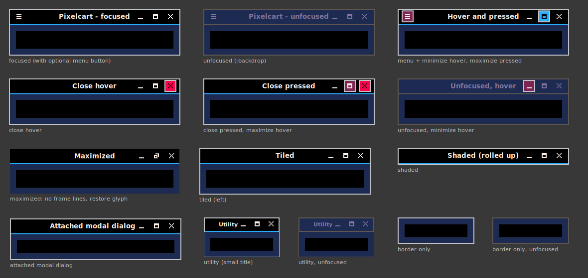

# cinnamon-store

Themes and widgets for the Cinnamon desktop on Linux Mint.

## Themes

| Theme | Status | Description |
|---|---|---|
| [Pixelcart](themes/Pixelcart) | Pre-release: not yet run on a live Cinnamon session | Dark, 8-bit styled theme on a classic 16-colour fantasy-console palette. Covers the Cinnamon desktop and GTK 2, GTK 3 and GTK 4 applications. |

## Screenshots

### Pixelcart

Design preview of the desktop. This is a rendered mock-up, not a capture of a
live session; it will be replaced once the theme has been run on Linux Mint.

The images below are real renders of the theme by GTK 3.24 and GTK 4.14.

GTK 3 (left) and GTK 4 (right) with the same widgets:

GTK 3 controls:

Menus:

Window title bars: focused, unfocused, hover and pressed, maximised, tiled:

## Layout

- `themes/<Name>/` - each theme in the directory structure the
  [Cinnamon Spices themes repository](https://github.com/linuxmint/cinnamon-spices-themes)
  expects, ready to copy into a fork of that repository.
- `docs/<name>/` - design spec, submission checklist, research notes and
  real-toolkit renders for each theme.

## Trying a theme

    cp -r themes/Pixelcart/files/Pixelcart ~/.themes/Pixelcart

Then choose it in System Settings -> Themes.

## Licence

GPL-3.0-or-later. See [LICENSE](LICENSE).
