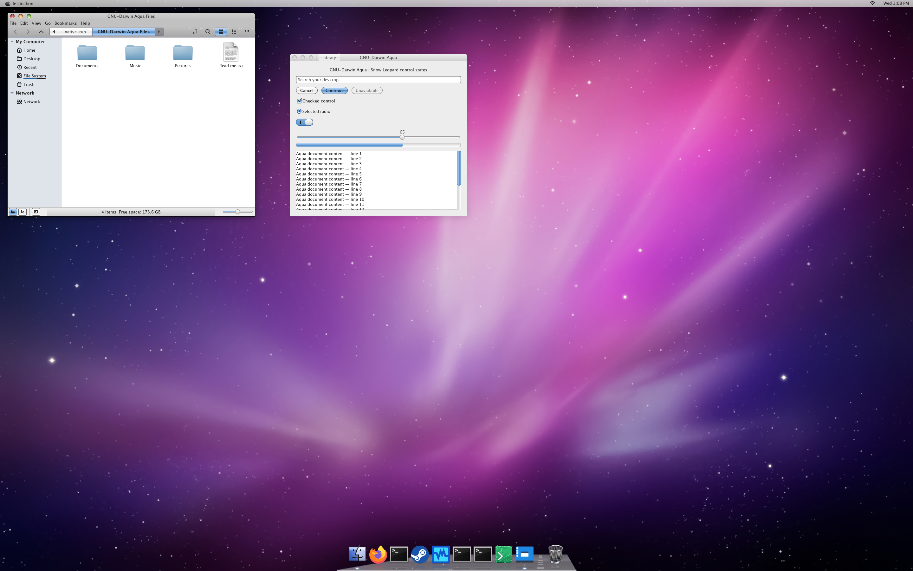
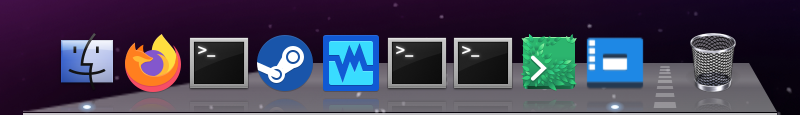

# GNU-Darwin Aqua — Snow Leopard edition



A Linux Mint Cinnamon theme targeting Mac OS X Snow Leopard 10.6: silver window chrome, left traffic lights, blue Aqua controls, a slim translucent menu bar and a perspective glass dock.



The dock uses **64px icons on a 66px pitch**, a **52px glass shelf** in an **84px bottom panel**, real icon reflections and blue-white running lights. Its extension decorates the standard Grouped window list, preserving application launching, window grouping, context menus and pinned order. Trash is a separate working endcap.

## Install the files

From this package directory, run as your desktop user, **without sudo**:

```sh
python3 install.py plan
python3 install.py install --apply
```

The helper copies three trees: the desktop theme to `~/.themes/GNU-Darwin Aqua`, its icons to `~/.icons/GNU-Darwin Aqua icons`, and the dock extension to `$XDG_DATA_HOME/cinnamon/extensions/snow-leopard-dock@desktop-theme-studio` (normally under `~/.local/share`). It verifies the payload manifest and refuses existing same-name installations or symlinked destination parents. Inspect and back up an existing copy before continuing.

This step copies files only. It does not change desktop settings, install fonts, enable the extension or provide an automatic session rollback. If a copy fails, inspect the reported destinations before retrying; a partial new tree is deliberately left intact.

## Select and configure

1. Install your own appropriately licensed **Lucida Grande** regular/bold fonts for the reference appearance. Use **10pt** for the interface and window titles; **Liberation Mono 10pt** for monospace. Font binaries are not bundled. Font substitution changes the appearance.
2. In Cinnamon **Themes**, choose **GNU-Darwin Aqua** for Desktop, Controls and Window borders, and **GNU-Darwin Aqua icons** for Icons. The preview uses **Bibata Modern Classic** cursors, installed separately. Configure window buttons on the left in close/minimize/maximize order.
3. Choose the installed `~/.themes/GNU-Darwin Aqua/artwork/wallpaper.png` in Backgrounds. The optional menu image is `artwork/menu-logo.png` in the same folder. Your menu label can remain unchanged.
4. Configure a **22px top panel** for menu/status items and an **84px bottom panel** with **64px full-color icons**. In panel edit mode, place one standard **Grouped window list in the CENTER zone of the bottom panel**. Keep other applets outside that bottom center zone. The extension preserves your existing pinned applications. Panel arrangement and size are manual Cinnamon settings; the file installer does not overwrite them.
5. With the Aqua dock extension disabled, bind it to your actual panel/applet IDs:

   ```sh
   python3 install.py configure-dock
   python3 install.py configure-dock --apply
   ```

   The first command previews the detected target; the second changes only the installed extension's `config.json`. It refuses missing or ambiguous targets. No GSettings values are written.
6. Open Cinnamon **Extensions** and enable **GNU-Darwin Aqua dock**. It attaches only while the **GNU-Darwin Aqua** desktop theme is selected. If you later move/recreate the Grouped window list, disable the extension and repeat step 5.

GTK2 requires the **Murrine** engine. The icon theme inherits **Papirus** and `hicolor` for applications outside its bundled coverage. The runtime is tested with **Cinnamon 6.6.9**.

## Undo

Disable **GNU-Darwin Aqua dock first**, then select your previous desktop theme, controls, window borders, icons, fonts and wallpaper. Restore your preferred panel arrangement. Only after disabling the extension, remove its installed directory and this package's two theme/icon directories, or restore your backed-up copies. Do not replace or remove extension files while it is running.

## Verified scope and limits

`acceptance.json` records the package verification and exact payload binding. The native check exercises the actual packaged theme, icons and extension at **2880×1800, UI scale 1**, with the external reference fonts/cursors available in the test session. It covers real application activation, native context menus, Trash, keyboard focus, workspace/theme changes, running lights, disable/re-enable and restoration. `payload-manifest.json` records the shipped bytes. Run the file-installation fixtures with:

```sh
python3 -B -m unittest test_install.py
```

This is a Snow Leopard appearance for Cinnamon, not a literal replacement for OS X. Magnification, Genie animation and reflections of overlapping windows are not implemented. Narrow-screen and HiDPI runtime acceptance remains outstanding. Nemo, global application menus, Linux text rendering and custom application chrome still differ. A pre-existing callback error in the test session's removed workspace-switcher applet is recorded separately; the dock's own cleanup and restoration pass. After the 28 checks passed, the outer test harness encountered a temporary portal-mount cleanup race; the mount subsequently detached and its owned temporary directory was removed. The preview wallpaper is painted on the private X root, so native Cinnamon wallpaper selection is not covered.

Terminal/application adapters, custom workspace applets, automatic theme switching, boot/login assets and a whole-workstation rollback controller are outside this store package. No host installation or boot/login test is implied by the private-session evidence.

## Sources and artwork

See [SOURCE-NOTICES.md](SOURCE-NOTICES.md) and [LICENSING.md](LICENSING.md). Mint and B00merang theme notices are retained. Apple wallpaper and period icon reproductions have separate, unresolved redistribution records; the repository's GPL license does not grant rights to those components. This package is submitted at the repository owner's explicit request, with that provenance status preserved. Lucida font software and cursor binaries are not included.
