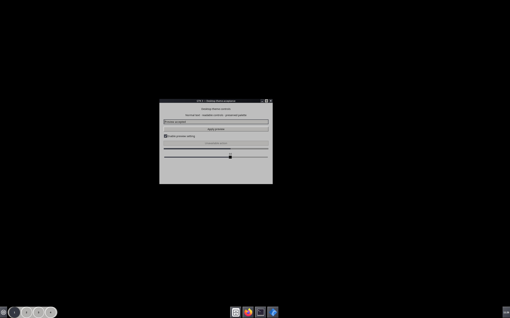

# GNU-Darwin Workstation



Cinnamon shell, GTK 2/3/4 controls and Metacity window borders, with the matching wallpaper and menu artwork. The screenshot shows this package in a private Cinnamon session using a 64px bottom panel, stock applets and Adwaita icons. Panel layout and icons are separate choices.

## Install and select

From this package directory, copy the theme into your personal theme folder. This command refuses to replace an existing installation:

```sh
(
name='GNU-Darwin Workstation'
destination="$HOME/.themes/$name"
if [ -L "$HOME/.themes" ] || { [ -e "$HOME/.themes" ] && [ ! -d "$HOME/.themes" ]; }; then
  printf '%s\n' "The theme directory must be a real directory, not a symlink or file." >&2
  exit 1
fi
if [ -e "$destination" ] || [ -L "$destination" ]; then
  printf '%s\n' "An installation already exists: $destination. Back it up before replacing it." >&2
  exit 1
fi
mkdir -p "$HOME/.themes"
cp -R -- "files/$name" "$destination"
)
```

Open Cinnamon **Themes** settings and choose **GNU-Darwin Workstation** for Desktop, Controls and Window borders. Your icons and cursor remain selected separately. The stylesheet supports the standard Workspace Switcher in **buttons** mode; the tested panel height is 64px.

Choose `~/.themes/GNU-Darwin Workstation/artwork/wallpaper.png` in Backgrounds if you want the matching wallpaper. The optional menu icon is `artwork/menu-logo.png` inside the same installed theme folder. Selecting a wallpaper or icon is a separate manual action.

To undo your selection, choose your previous Desktop, Controls, Window borders and wallpaper in Cinnamon settings. After switching away, remove only this theme's installed directory, or move your previously saved copy back into place. This package does not provide a settings backup or automatic session rollback.

## Dependencies and scope

- gtk-engine: **murrine** — Referenced by GTK2 theme rules; required for GTK2 coverage.
- font: **Liberation Sans** — Named in shipped desktop CSS; fonts are installed separately.

Icons, cursors, fonts, panel arrangement, custom applets, Island/Eww, terminal/application adapters and boot/login assets are not bundled. No scripts execute during installation and no system files are replaced. GTK4 evidence covers standard GTK4 widgets; applications that enforce their own styling may differ.

## Validation and artwork

The packaged files were rendered in private Cinnamon 6.6.9 at 2880×1800. All four stock workspace controls accepted native pointer clicks; menu, notification and sound popups painted and closed; GTK 2/3/4 controls mapped with selected-theme and callback readback. These checks cover desktop theme behavior. They do not establish full workstation, live activation, boot or login acceptance.

`acceptance.json`, `readiness.json` and `theme-files.sha256.json` record the scope and exact file bindings. Artwork bytes and palette values are preserved. The store copy removes optional icon/cursor selection keys and non-rendered Inkscape export paths.

Theme code retains the original GPL-3.0-or-later notices. Artwork keeps its component terms; see `SOURCE-NOTICES.md`, `COPYRIGHT` and the included artwork notices.
