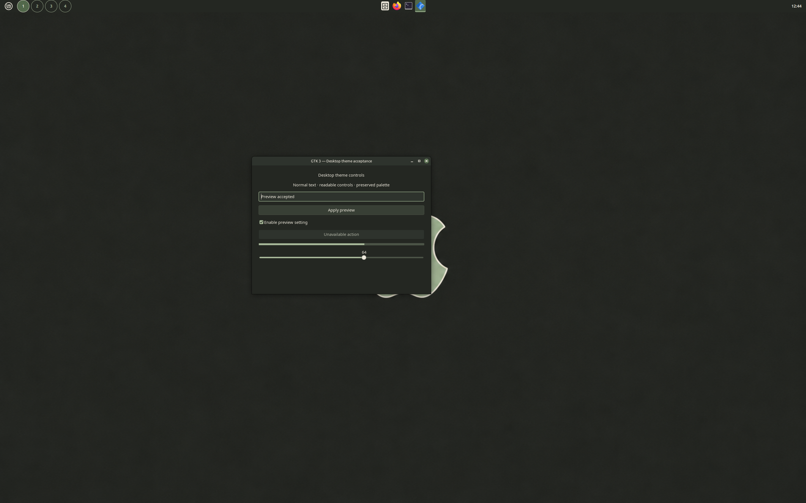

# Quiet Sage



Quiet dark sage desktop with muted green accents and flat readable controls. Includes Cinnamon, GTK 2/3/4, Metacity and preserved artwork.

This package provides Cinnamon shell styling, GTK 2/3/4 controls, Metacity window borders and preserved wallpaper/menu artwork. The exact install name is **Quiet Sage**. The preview shows a genuine private package session with a 44px top panel, stock Cinnamon applets and Adwaita icons. Panel arrangement and icons are separate choices.

## Install and select

Run this example from this package directory. It refuses an existing same-name installation and refuses a symlink or non-directory at the personal theme parent. Review any existing installation and back it up or move it yourself before trying again.

```sh
(
name='Quiet Sage'
parent="$HOME/.themes"
destination="$parent/$name"
if [ -L "$parent" ] || { [ -e "$parent" ] && [ ! -d "$parent" ]; }; then
  printf '%s\n' "The theme parent must be a real directory, not a symlink or file." >&2
  exit 1
fi
for existing in "$destination" "${XDG_DATA_HOME:-$HOME/.local/share}/themes/$name" "/usr/local/share/themes/$name" "/usr/share/themes/$name"; do
  if [ -e "$existing" ] || [ -L "$existing" ]; then
    printf '%s\n' "A same-name theme already exists: $existing. Review and back it up manually." >&2
    exit 1
  fi
done
mkdir -p -- "$parent" || exit 1
mkdir -- "$destination" || exit 1
cp -R -- "files/$name/." "$destination/" || exit 1
)
```

Open Cinnamon **Themes** settings and choose **Quiet Sage** for Desktop, Controls and Window borders. Select icons and cursors separately. To use the shipped workspace visuals, enable the standard **Workspace Switcher** applet in **buttons** mode. Its tested panel height is 44px at the top; this package installs no replacement applet or panel configuration.

Choose `~/.themes/Quiet Sage/artwork/wallpaper.png` manually in Backgrounds for the matching wallpaper. The optional menu graphic is `artwork/menu-logo.png` in that installed theme folder. These files are not applied automatically.

To restore your previous appearance, select the previous Desktop, Controls, Window borders and wallpaper through Cinnamon settings. After switching away, uninstall by removing only `~/.themes/Quiet Sage` that you installed with this example, or move your explicitly saved previous copy back into place. This package supplies no settings backup, automated activation or session rollback controller.

## Dependencies and scope

- gtk-engine: **murrine** — Referenced by GTK2 theme rules; required for GTK2 coverage.
- font: **Ubuntu** — Named in shipped desktop CSS; fonts are installed separately.
- icon-theme: **Quiet Sage icons** — Original source composition selected this separate component. It is not bundled or selected by this desktop package.
- cursor-theme: **Quiet Sage cursors** — Original source composition selected this separate component. It is not bundled or selected by this desktop package.

GTK2 requires the declared system engine to be available (on Linux Mint/Ubuntu, Murrine is provided by `gtk2-engines-murrine`). Fonts are installed separately. The private screenshots use standard Adwaita icons/cursors and OS application launchers, which are not bundled. GTK3/4 evidence covers the supplied native control fixtures; individual applications may use their own styling.

Icon/cursor binaries, fonts, panel layout, workspace applet runtime, Island/Eww, application/terminal adapters, boot/login themes and activation/restore controllers are separate optional components. This package includes none of those integrations and does not claim their full-workstation acceptance.

## Evidence and preserved sources

The shipped desktop styling and artwork preserve the repaired candidate palette. Export-only SVG author-path metadata and unbundled icon/cursor defaults were cleaned without changing their rendering.

Enabled scale numbers and marks use the existing palette foreground at full opacity; disabled dimming is retained. GTK4 enabled progress/highlight fills and slider thumbs use the existing accent and foreground roles with selectors that match GTK4 child nodes.

`readiness.json` binds the actual shipped palette, artwork, dependencies and fresh package screenshot/report. Private tests cover stock workspace pointer actions, bounded popups, GTK fixtures, theme reload and owned session cleanup. No old full-composition screenshot is used as this package's preview. Menu captures containing account identity remain outside the export.

The desktop source is Mint-derived GPL-3.0-or-later; exact upstream notices and full license text are retained. **The supplied artwork’s original source/creator and redistribution grant remain unrecorded.** Keeping the approved artwork byte-exact does not assign Mint GPL to those images. See `LICENSING.md`, `SOURCE-NOTICES.md` and the current provenance review. This desktop package is submitted to cinnamon-store at the repository owner’s explicit request; publication does not resolve the missing artwork record. Canonical candidate gates and historical sources remain unchanged.

The current private native receipt is `20260930-124403`: all 11 bounded checks passed against the exact shipped theme tree, including GTK2/3/4, stock workspace pointer actions, popups, reload and owned cleanup. The GTK3 preview is byte-exact from that session. Independent visual acceptance is kept in the local review index; public redistribution of the supplied composite artwork remains blocked pending its grant record.
